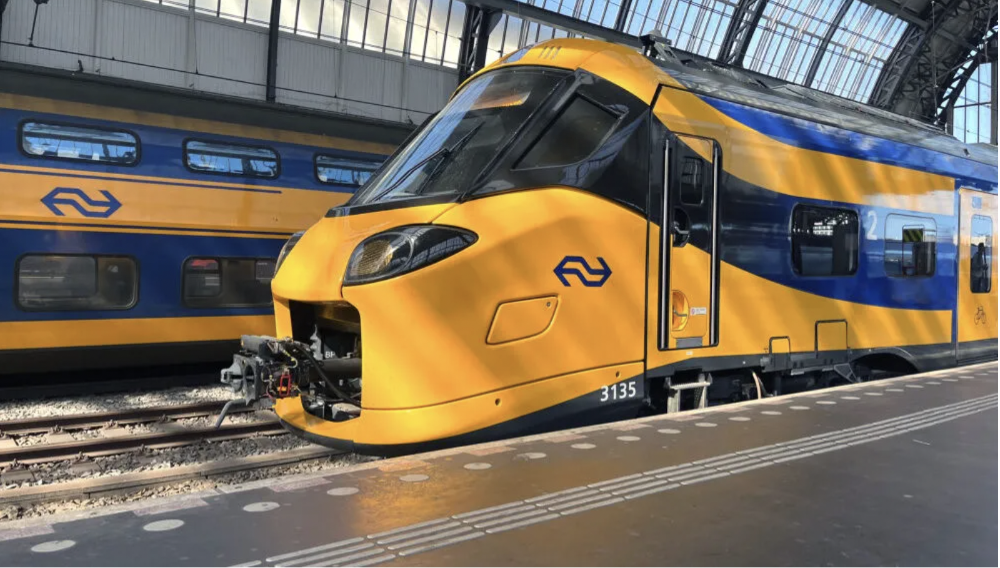
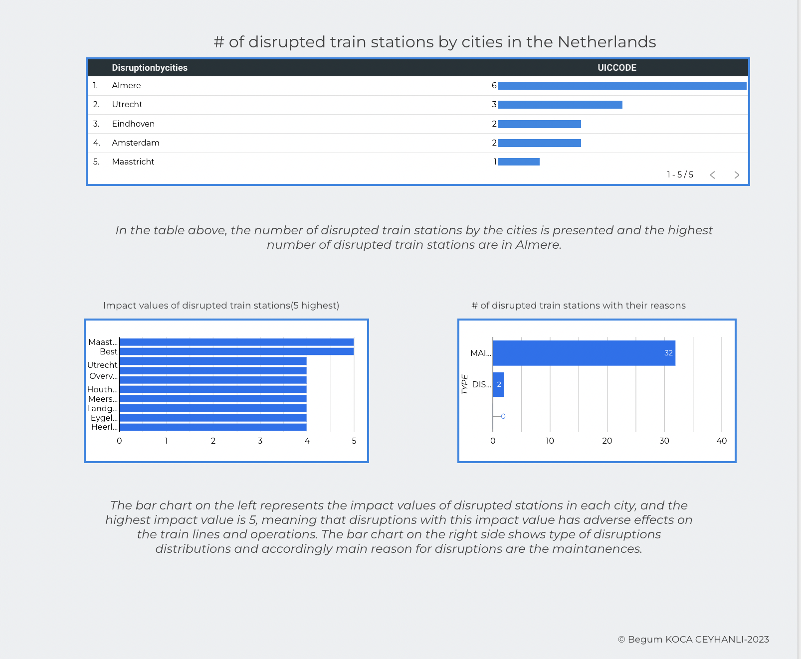

<div align="center">
 <br />


# Dutch Train Stations and Disruptions Analysis 


</div>

## :bookmark_tabs: Menu

- [Business Problem](#Business-Problem)
- [API Connection](#API-Connection)
- [Snowflake](#Snowflake)
- [Looker Studio](#Looker-Studio)
- [Folder Structure](#closedbook-results)
- [Author](#smiley_cat-author)

## Business problem


The Netherlands, celebrated for its efficient public transportation system, boasts a network of train stations connecting cities and regions seamlessly. Despite the commendable infrastructure, navigating through potential disruptions remains a significant concern for commuters. To shed light on this aspect, a comprehensive analysis has been meticulously conducted, offering insights into the operational dynamics of train stations and the impact of disruptions on the Dutch rail network.

The inception of this project faced challenges related to the acquisition of accurate datasets and the development of robust data pipelines. A strategic decision was made to gather data from authoritative sources, including the official Dutch railway portal and other relevant platforms. Employing an API integration, the data was collected to ensure a comprehensive and up-to-date dataset. Subsequently, data cleaning and transformation were carried out to prepare the dataset for thorough analysis.

Study Overview:
This study provides a detailed examination of train stations across the Netherlands, delving into key operational aspects and disruptions that may impact commuter experiences. The analysis encompasses factors such as station facilities, punctuality, and the frequency and nature of disruptions. The datasets utilized in this study were procured from official railway sources, ensuring reliability and accuracy.

Architectural Framework:
The architectural framework of the project is structured into three main components:

Data Procurement: Datasets were sourced from official Dutch railway portals and other authoritative platforms using a combination of web scraping and API integration.

Data Processing: Robust data pipelines were developed to clean and transform the datasets, ensuring accuracy and consistency. The processed data was then ready for comprehensive analysis.

Analysis and Insights: The study focuses on various aspects of train stations and disruptions. The datasets, obtained from reliable sources, enable a thorough examination of the operational dynamics of the Dutch rail network.

This analysis aims to provide commuters, policymakers, and transportation authorities with valuable insights into the operational efficiency of train stations and the challenges posed by disruptions. By understanding these dynamics, stakeholders can work towards enhancing the overall commuter experience and fortifying the resilience of the Dutch rail network.

The architectural framework of the project is thoughtfully segmented into three main components, as follows:


- #### Data Procurement <font color='gray'> (by API connection using Python) </font>
- #### Data Preperation and Processing <font color='gray'>(by using Snowflake) </font>
- #### Data Visualization <font color='gray'>(by using Looker Studio) </font>


Here is the overall architecture flow:


# API Connection 
In this notebook, we will create a dataset of train stations and disruptions found from [NS API Portal](https://apiportal.ns.nl/) (Dutch transportation website). In order to do this, I have created some reguests by using python and I have used different libraries like JSON,requesnt and pandas in python.  

This notebook is part of my train stations data series in which I have created a dataset by using requests.

For more details on the scraping code and libraries please refer to [script.ipynb](/Users/begumkoca/Documents/GitHub/nederlandse-spoorwegen/script.ipynb)


# Snowflake

#### Data Warehouse and ETL with SQL

In this part, data is loaded into Snowflake and null handling and transformation steps are performed by using SQL queries. Data exploration, data preperation and data modelling and validation has been completed.


This is created as the final table and all the data type transformations done in snowflake:


```console
CREATE OR REPLACE TABLE NL.HJ.Stations_Disruptions_NL AS
SELECT 
ID,
station.uiccode,
type,
stationcode,
name,
namen_lang,
stationtype,
registrationtime,
releasetime,
local,
title,
topic,
isactive,
start_time,
end_time,
phase_id,
phase_label,
impact_value,
expectedduration_endtime,
period,
summaryadditionaltraveltime_maximumdurationinminutes as max_duration,
summaryadditionaltraveltime_minimumdurationinminutes as min_duration,
sectiontype,
section_direction,
consequence_section_direction,
consequence_description,
coordinate_lat,
coordinate_lng
FROM dist
LEFT JOIN station
ON dist.uiccode=station.uiccode
```


Here are some screenshots from Snowflake to show how the schemas and tables look like:


# Looker Studio 

#### Visualizations

And as a final step Snowflake is connected with Looker Studio then the visualizations are performed.

To view the dashboard please use the [Dashboard](https://lookerstudio.google.com/u/0/reporting/26122bc4-607d-41fc-a635-94927f7d36b6/page/UuMjD) link here.

And for a quick overview please refer to the below:





## :open_file_folder: Folder Structure

```
.
├── assets                                   # Images for notebook
├── scraping.ipynb                           # Main notebook                       
└── README.md
```


## :smiley_cat: Author

- [@begussimo](https://github.com/begussimo)